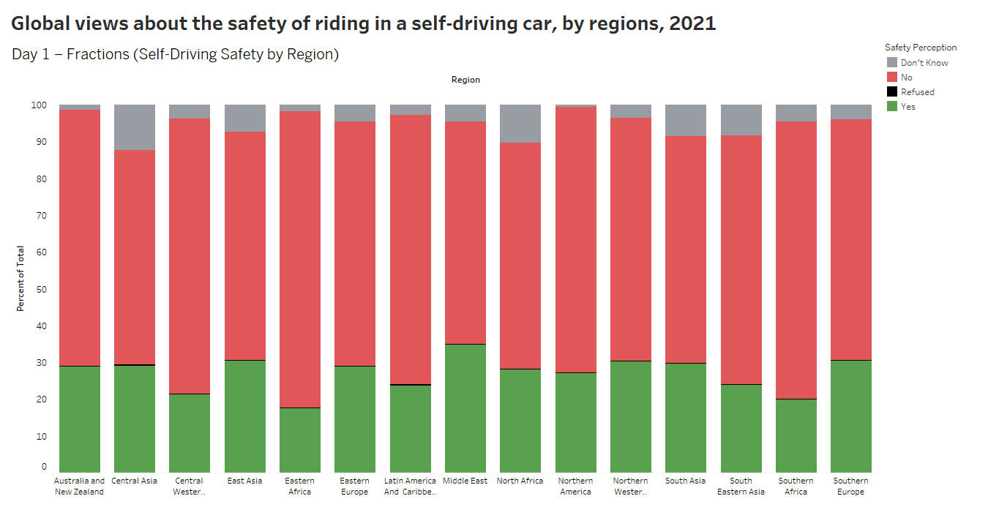

# 📊 Day 1 – Fractions  
**Prompt:** Visualize fractions or parts of a whole  
---

## 🧠 Topic: Do People Feel Safe in Self-Driving Cars?

This visualization explores how different **global regions** perceive the safety of **self-driving vehicles**, based on 2021 survey data from [Pew Research Center](https://www.pewresearch.org/global/2021/09/13/global-public-opinion-on-the-future-of-the-internet/).

The responses are split into:
- ✅ **Yes, would feel safe**
- ❌ **No, would not feel safe**
- ❓ **Don’t know**
- 🚫 **Refused to answer**
---

## 📊 Visualization: Stacked 100% Bar Chart  
Each bar represents a region, segmented to show the fraction of people selecting each response.

🔗 **[View this viz on Tableau Public →](https://public.tableau.com/views/Globalviewsaboutthesafetyofridinginaself-drivingcarbyregions2021/Dashboard1?:language=en-GB&publish=yes&:sid=&:redirect=auth&:display_count=n&:origin=viz_share_link)**

  

---

## 📁 Files Included
- `global-views-safety-self-driving-car-by-demographic-group.csv` – Raw data on self-driving car safety opinions
- `day1.png` – Static preview of the chart

---

## 🛠 Tools Used
- Tableau Public
- Pew Research Center dataset (2021)
- GitHub for documentation

---

